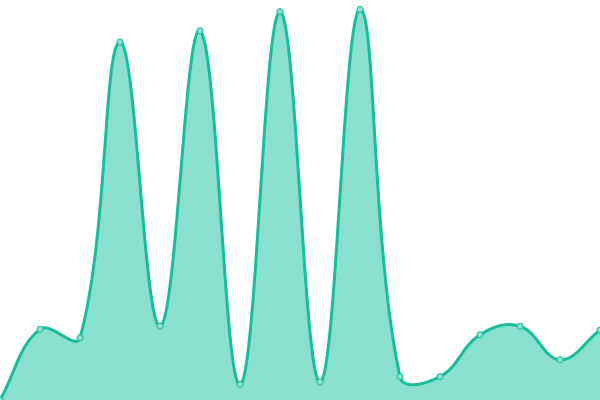
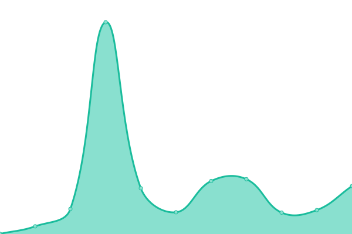

# [📈 Live Status](https://status.czqm.ca): <!--live status--> **🟧 Partial outage**

This repository contains the open-source uptime monitor and status page for [CZQM / QX FIR](http://czqm.ca), powered by [Upptime](https://github.com/upptime/upptime).

With [Upptime](https://upptime.js.org), you can get your own unlimited and free uptime monitor and status page, powered entirely by a GitHub repository. We use [Issues](https://github.com/CZQM-FIR/uptime/issues) as incident reports, [Actions](https://github.com/CZQM-FIR/uptime/actions) as uptime monitors, and [Pages](https://status.czqm.ca) for the status page.

<!--start: status pages-->
<!-- This summary is generated by Upptime (https://github.com/upptime/upptime) -->
<!-- Do not edit this manually, your changes will be overwritten -->
<!-- prettier-ignore -->
| URL | Status | History | Response Time | Uptime |
| --- | ------ | ------- | ------------- | ------ |
|  [Main Website](https://czqm.ca) | 🟩 Up | [main-website.yml](https://github.com/CZQM-FIR/uptime/commits/HEAD/history/main-website.yml) | 

 616ms
     
 | 

<a href="https://status.czqm.ca/history/main-website">99.88%</a>
    

|  [Overseer](https://overseer.czqm.ca) | 🟩 Up | [overseer.yml](https://github.com/CZQM-FIR/uptime/commits/HEAD/history/overseer.yml) | 

 389ms
     
 | 

<a href="https://status.czqm.ca/history/overseer">100.00%</a>
    

|  [Worker](http://worker.czqm.ca/cron-health) | 🟩 Up | [worker.yml](https://github.com/CZQM-FIR/uptime/commits/HEAD/history/worker.yml) | 

 733ms
     
 | 

<a href="https://status.czqm.ca/history/worker">100.00%</a>
    

|  [Training LMS](https://training.czqm.ca) | 🟥 Down | [training-lms.yml](https://github.com/CZQM-FIR/uptime/commits/HEAD/history/training-lms.yml) | 

 3760ms
     
 | 

<a href="https://status.czqm.ca/history/training-lms">100.00%</a>
    

<!--end: status pages-->

[**Visit our status website →**](https://status.czqm.ca)

## 📄 License

- Powered by: [Upptime](https://github.com/upptime/upptime)
- Code: [MIT](./LICENSE) © [Anand Chowdhary](https://anandchowdhary.com), supported by [Pabio](https://pabio.com)
- Data in the `./history` directory: [Open Database License](https://opendatacommons.org/licenses/odbl/1-0/)
